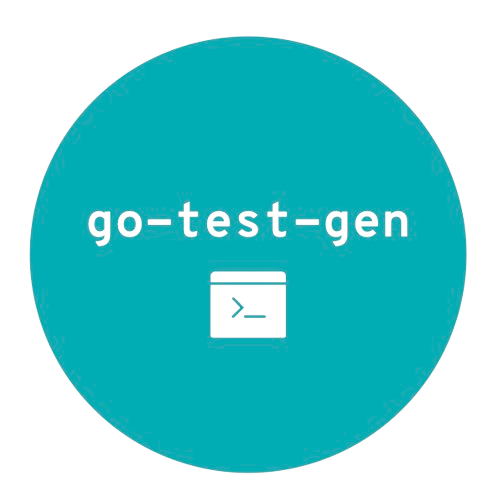

## Go Test Generator (AKA go-test-gen)

This CLI enables to create automatically tests skeletons for your Golang projects.


[](https://sonarcloud.io/summary/new_code?id=dterbah_go-test-gen)
[](https://sonarcloud.io/summary/new_code?id=dterbah_go-test-gen)
[](https://sonarcloud.io/summary/new_code?id=dterbah_go-test-gen)
[](https://sonarcloud.io/summary/new_code?id=dterbah_go-test-gen)



## Installation

To install this CLI in your global environment, you can use the following command :

```bash
    go install github.com/dterbah/go-test-gen
```

## Usages

The command to generate test of your project is the following one :

```bash
    # Create tests skeleton for a project
    go-test-gen generate --project="/path/to/golang/project"
    # or
    go-test-gen generate -p="/path/to/golang/project"

    # Create tests for a single go file
    go-test-gen generate --file="path/to/file"
    # or
    go-test-gen generate -f="path/to/file"
```

This command will automatically create tests for all your .go files. If a test
already exists for a file, it will take all the current content of your file and
update it with the missing tests.

## Configuration of CLI (for project)

You can configure the CLI via a `.go-test-gen.json` in the root of your project. Here are the different options you can use :

| Option                   | Type       | Description                                                                                                  | Default value |
| ------------------------ | ---------- | ------------------------------------------------------------------------------------------------------------ | ------------- |
| generatePrivateFunctions | `bool`     | Defines if the CLI has to create tests for private functions                                                 | `false`       |
| generateEmptyTests       | `bool`     | Defines if the CLI has to create file tests for empty go files or go files without any functions             | `false`       |
| excludeFiles             | `[]string` | Defines files to that not need to have attached test. For example, you can have `["main.go", "*_config.go"]` | `[]`          |
| verbose                  | `bool`     | If this option is false, you will have less logs than usually                                                | `true`        |
